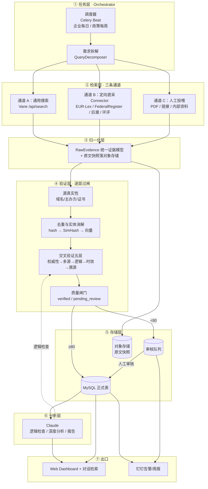
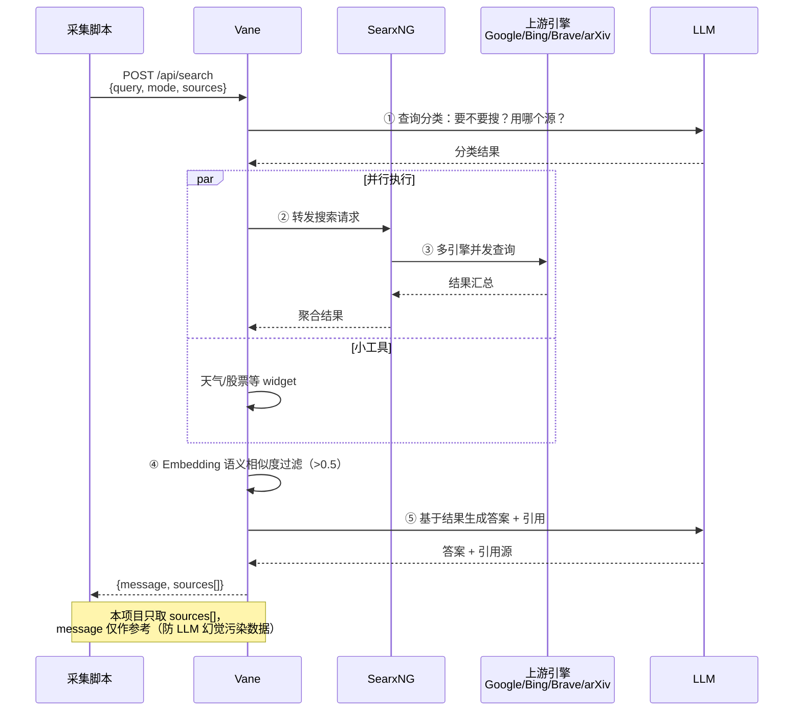
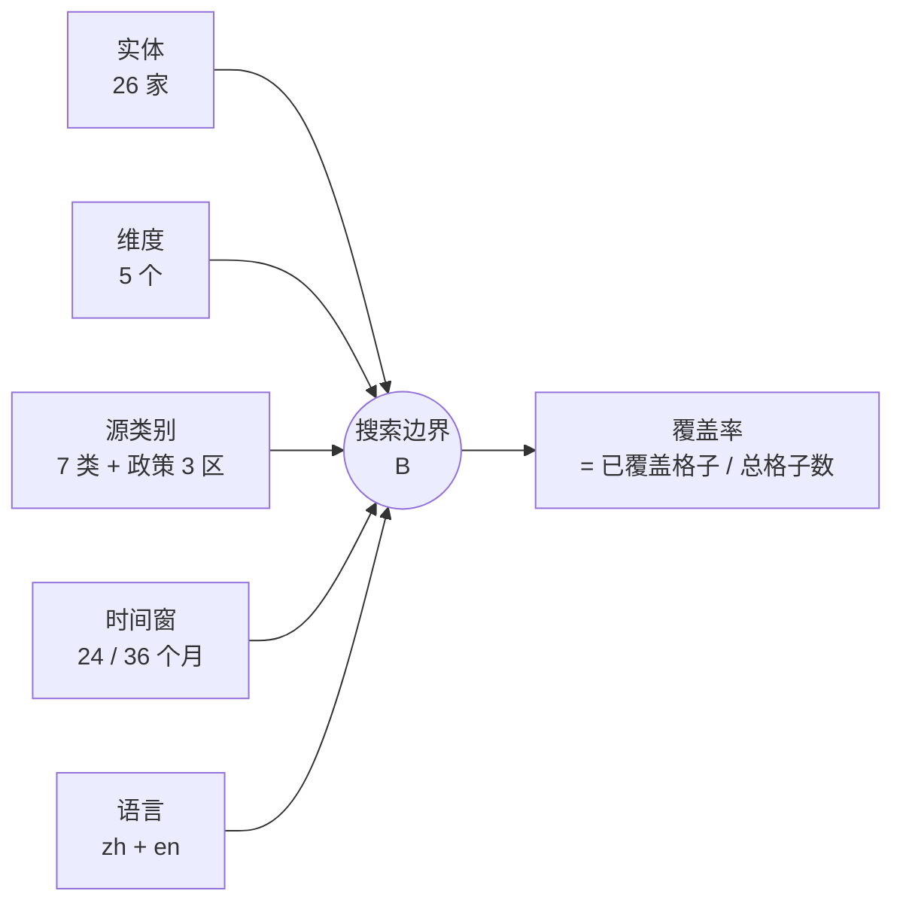
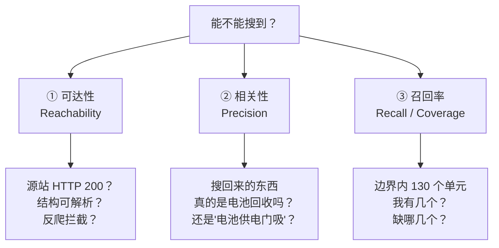
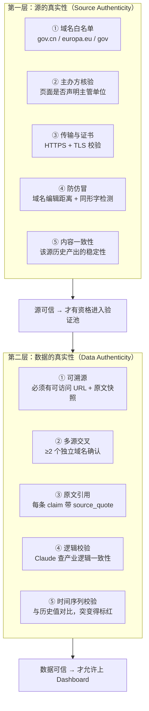
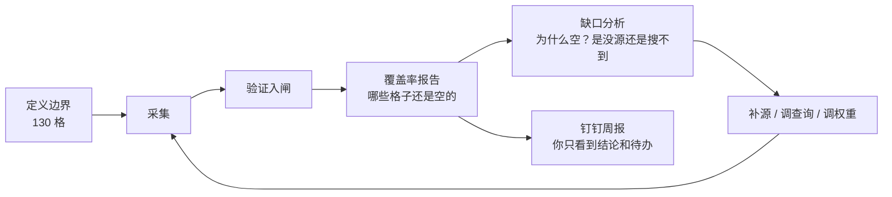

# 🏗️ 系统架构 —— Vane / SearxNG 如何发挥作用

> 配套阅读：[03 数据源管理和验证体系](03_数据源管理和验证体系.md) · [04 二次开发方案-后端](04_二次开发方案-后端.md)
> 本文回答四个问题：**① 系统长什么样 ② Vane 和 SearxNG 各自干什么 ③ 搜索边界在哪 ④ 怎么证明"搜得到、搜得准、搜得全"**
> 所有 ⚠️ 标记的都是**本机实测结论**（2026-09-10），不是推断。

---

## 一、全景架构图



---

## 二、Vane 和 SearxNG 到底各干什么

很多人把这两个搞混。**它们不是同一层的东西**：

```
┌──────────────────────────────────────────────────────────────────┐
│                         Vane（应用层）                            │
│  职责：问题分类 → 决定搜不搜 → 多源聚合 → 语义过滤 → LLM 生成答案   │
│  它是"情报流水线的总调度和加工厂"                                  │
│                                                                  │
│   ┌────────────────────────────────────────────────────────┐    │
│   │                  SearxNG（元搜索层）                     │    │
│   │  职责：把一次查询同时打到 Google / Bing / Brave /        │    │
│   │        DuckDuckGo / Wikipedia / arXiv… 并汇总结果        │    │
│   │  它是"搜索入口的聚合器"，只负责『把网页找出来』           │    │
│   └────────────────────────────────────────────────────────┘    │
│                                                                  │
│   此外 Vane 还管：Embedding 语义相似度过滤(>0.5)、会话历史、      │
│                   文件上传(PDF/图片)、API 暴露(/api/search)      │
└──────────────────────────────────────────────────────────────────┘
```

| 维度 | SearxNG | Vane |
|---|---|---|
| 定位 | 元搜索引擎（聚合上游引擎） | AI 搜索应用（聚合 + 理解 + 生成） |
| 输入 | 关键词 | 自然语言问题 + 历史对话 |
| 输出 | 网页结果列表（标题/URL/摘要） | 结构化答案 + 引用源 + 相似度分数 |
| 是否用 LLM | ❌ 不用 | ✅ 用（分类、过滤、生成） |
| 能否绕过单一引擎限制 | ✅ 核心价值 | 继承 SearxNG 能力 |
| 隐私 | 自建即隐私 | 本地部署即隐私 |
| **在本项目中的角色** | **"广度来源"**：负责发现未知源、长尾信息 | **"调度中枢"**：负责拆解、聚合、初筛、供 API 给采集脚本 |

### 2.1 关键设计决策：为什么不能只靠 Vane

⚠️ **实测结论**：`eur-lex.europa.eu` 对普通 HTTP 客户端返回 **202 + 挑战页**（即使伪装浏览器 UA 也一样）。
也就是说——**欧盟法规的权威原文，通用搜索通道确实"搜不到"（拿不到正文）**。

所以三条通道必须并存，各管一段：

| 通道 | 管什么 | 覆盖率贡献 | 可信度贡献 |
|---|---|---|---|
| A · Vane/SearxNG | **广度**：发现你还不知道的源 | ⭐⭐⭐⭐⭐ | ⭐⭐ |
| B · 定向直采 Connector | **深度**：权威源原文与结构化字段 | ⭐⭐⭐ | ⭐⭐⭐⭐⭐ |
| C · 人工投喂 | **补盲**：内部资料、线下信息 | ⭐ | ⭐⭐⭐⭐⭐ |

> 一句话：**Vane 负责"找得到"，Connector 负责"拿得准"，人工负责"补得上"。**

### 2.2 Vane 的完整调用链（本项目视角）



> **重要**：本项目**不信任 Vane 生成的 `message` 字段作为事实来源**——它只用于启发式判断。
> 入库的是 `sources[]` 里的**原文片段**，且必须走交叉验证。这是"防止 LLM 幻觉进正式库"的第一道防线。

---

## 三、搜索边界（Search Boundary）—— 你到底要搜什么范围

"搜到全部"必须先定义**"全部"的边界**。无边界的"全部"是无法验证的。
边界 = **五维笛卡尔积中你实际承诺覆盖的子集**：

```
搜索边界 B = 实体 E × 维度 D × 源类别 S × 时间窗 T × 语言 L

E 实体：26 家企业（见 sources/companies.yaml）
D 维度：5 个（hr / feedstock / operation / strategy / technology）
S 源类：7 类（年报 / 环评 / 公告 / 招投标 / 专利 / 新闻 / 行业数据库）
         + 政策 3 区（CN / EU / US）
T 时间：企业动态窗口 24 个月；政策窗口 36 个月（含征求意见稿阶段）
L 语言：zh（中文原生）+ en（英文，需翻译入库）
```



**边界内的单元格总数**（这是你的"考核目标"）：

```
企业 26 × 维度 5 × 源类别 7  = 910 个"采集单元"
其中"必备单元"（企业×维度，不含源类别）= 26 × 5 = 130 个

政策侧：
EU 源 13 × 主题 9 = 117
US 源 13 × 主题 7 = 91
CN 源 待定
```

🔴 **明确不覆盖的（写进边界文档，避免无限扩大）**：
- 未公开/内部信息（本项目只做 OSINT）
- 付费墙内容（GGII 付费报告正文、SMM 付费数据）
- 个人隐私信息（自然人手机号、身份证等）
- 需要登录才能访问的社交平台私域内容
- 非中文/非英文的其他语种原文（可经翻译间接覆盖）

---

## 四、三个层次的"搜得到"验证（这是你最关心的）

你的要求是"**搜索范围内全部都有并且正确**"。这必须拆成三个可独立测量的指标：



### 4.1 ① 可达性（Reachability）

⚠️ **本机实测结果（2026-09-10）**：

跑 `scripts/verify-sources.ps1` 可一键复现下表（2026-09-10 实测输出）：

| 源 | 端点 | HTTP | 实测命中 | 结论 |
|---|---|---|---|---|
| 🇺🇸 Federal Register API | `/api/v1/documents.json` | **200** | **48 条**（16 页） | ✅ 可直接采，**无需 API Key** |
| 🇪🇺 Publications Office SPARQL | `/webapi/rdf/sparql` | **200** | **15 个 CELEX**（含 14 个更正版本） | ✅ 官方机器接口可用 |
| 🇪🇺 DG ENV 电池专题页 | `/topics/waste-and-recycling/batteries_en` | **200** (84 KB) | 含法规链接 | ✅ 可采 + 可 diff |
| 🇪🇺 EUR-Lex HTML 正文 | `/legal-content/EN/TXT/?uri=CELEX:...` | **202**（挑战页，伪装 UA 也 202） | 0 | 🚫 **被反爬**，走 SPARQL 替代 |
| 🇪🇺 EUR-Lex ELI 页 | `/eli/reg/2023/1542/oj` | **202** | 0 | 🚫 同上 |
| 🇪🇺 Cellar `/resource/celex/...` | | **400** | 0 | ❌ 需特定 Accept 协商，暂不用 |
| 🇪🇺 ECHA | `/regulations/batteries-regulation` | **403** | 0 | 🚫 反爬，降级为 `site:` 搜索 |

> 💡 **一个意外收获**：SPARQL 显示电池法规 (EU) 2023/1542 有 **14 个更正版本**。
> 一部被反复更正的法规，说明其条文在实务中存在大量歧义——这本身就是值得跟踪的情报信号，
> 也是"通用搜索引擎给不了、只有结构化源才给得了"的价值证明。

**这个表就是"能不能搜到"的答案。** 结论：
- ✅ 美国侧**完全打通**（连 API 都是开放的）
- ✅ 欧盟侧**走 SPARQL 打通**（拿到了法规本体 + 更正版本）
- ⚠️ 欧盟 HTML 正文层被拦——但**不影响情报获取**，因为 SPARQL 能给出 CELEX、生效日期、修订关系、更正版本等**比正文更结构化的字段**

### 4.2 ② 相关性（Precision）—— 边界内的"必须是这个"

⚠️ **实测发现的关键问题**：用关键词 `batter` 查询欧盟立法，返回的第一批结果是
*"battery-powered hold-open systems"*（**电池供电的门吸**，建筑产品指令），**完全不相关**。

这证明：**纯关键词匹配 = 大量假阳性**。所以必须建"相关性判定规则"：

```yaml
# 三段式相关性判定（全部规则见 sources/search-boundary.yaml）
必修（必须命中 ≥1）:
  - 电池回收/再生:  电池回收, 退役电池, 废旧电池, 梯次利用, 再生利用
  - 英文对应:      battery recycling, waste batteries, end-of-life battery,
                   repurposing, second life, black mass
  - 法规主题:      电池法规, 回收率, 生产者责任, 电池护照, 碳足迹, 尽职调查
拒绝（命中即丢弃，即使关键词匹配）:
  - 非回收语境:    battery-powered, 电池供电, 纽扣电池（消费品）, 蓄电池启动
  - 非目标行业:    消费电子电池, 铅酸启动电池（除非政策相关）
人工复核（模糊地带，必须人工裁决）:
  - 固态电池、钠离子电池（技术相关但非回收主线）
  - 海外建厂（可能属 strategy 维度，也可能完全不相关）
```

### 4.3 ③ 召回率 / 覆盖率（Recall）—— "全部都有"的量化

**做法**：把边界拆成格子，逐格检查"有没有、够不够"。

```
覆盖率 = 已达标格子数 / 边界内总格子数

单个格子的达标判定（三个条件同时满足才算"覆盖"）:
  ① 数量：该格子 verified claim ≥ 阈值（默认 3 条）
  ② 质量：平均 quality_score ≥ 70
  ③ 时效：最新一条 claim 距今 ≤ 该维度的时效上限

格子状态：
  🟢 covered    三项全过
  🟡 weak       有数据但不达标（数量/质量/时效之一不足）
  ⚪ empty      一条都没有
  ⚫ out-of-scope 明确不覆盖（如付费墙）
```

**输出示例**：

```
【覆盖率报告】2026-09-10
边界：26 企业 × 5 维度 = 130 格
┌──────────────┬──────┬──────┬──────┬─────────┬──────────┐
│ 企业          │  🟢  │  🟡  │  ⚪  │ 覆盖率   │ 主要缺口  │
├──────────────┼──────┼──────┼──────┼─────────┼──────────┤
│ 格林美 gemm   │  5   │  0   │  0   │ 100%    │ —        │
│ 邦普 brunp    │  3   │  2   │  0   │  60%    │ feedstock│
│ 金晟 jinsheng │  1   │  1   │  3   │  20%    │ 环评源缺失│
│ ...           │      │      │      │         │          │
├──────────────┼──────┼──────┼──────┼─────────┼──────────┤
│ 合计          │  42  │  31  │  57  │  32.3%  │          │
└──────────────┴──────┴──────┴──────┴─────────┴──────────┘

💡 建议下一步：
  1. 57 个空格的共同原因：非上市企业缺"环评"直采源 → 优先建 eia connector
  2. 邦普 feedstock 弱：需要补充 湖南/广东 地方生态环境厅源
```

**没有这张表，就永远无法回答"是不是全部都有"。**

---

## 五、真实性验证（你要的"数据源和数据都要验证真实性"）

必须**分两层**，混合就会漏：



### 5.1 源真实性：域名白名单是第一道闸

```
🟢 官方域名模式（永久白名单）
   *.gov        *.gov.cn      gov.uk
   *.europa.eu  eur-lex.europa.eu   europa.eu
   *.org.cn（政府/协会备案）   *.edu.cn

🟡 行业权威（需人工确认主页后加入白名单）
   gg-lb.com  smm.cn  cninfo.com.cn  cabia.org.cn ...

🔴 自动拒绝
   - 与白名单域名的编辑距离 ≤ 2（防 one.gov.cn vs gоv.cn 同形字）
   - 新注册域名（WHOIS < 180 天）冒充官方
   - 无 HTTPS 或证书无效
   - 内容与已知官方源高度雷同但域名不同的"镜像站"
```

### 5.2 数据真实性：三条铁律（已在 04 篇定义，此处不重复）

```
① 无来源 URL          → 永不 verified
② 存在数据冲突         → 永不 verified（必须人工裁决）
③ 单一来源且非官方源    → 永不 verified
```

---

## 六、闭环：怎么持续保证"搜得全且正确"



**每周一次自动回答三个问题**：
1. 边界内还有多少空格？（覆盖率）
2. 哪些空格是因为**没有数据源**造成的？（需要补源）
3. 哪些空格是因为**源里有但没搜到**造成的？（需要调查询/加源权重）

---

## 七、本机实测结论汇总（可复现）

| # | 结论 | 证据 |
|---|---|---|
| 1 | Federal Register API 无需 Key 可用 | `curl` 返回 `200`，4680 bytes JSON |
| 2 | 欧盟 SPARQL 端点可用 | `POST/GET /webapi/rdf/sparql` 返回 `200 application/sparql-results+json` |
| 3 | SPARQL 能查到电池法规本体 | 查到 15 个 CELEX，其中 **14 个是更正版本** `R(01)(02)(04)(06)...` |
| 4 | SPARQL 支持标题关键词发现 | 查到 `32025D1769` 等 2025 年新立法 |
| 5 | 标题搜索**有大量假阳性** | `batter` 命中"battery-powered hold-open systems"（建筑产品，无关） |
| 6 | 同一 CELEX 返回**多语言重复** | 同一法规返回 da/de/en/fr/it 五语标题 → 必须 `xml:lang=en` 过滤 |
| 7 | EUR-Lex HTML 被反爬 | `202`，伪装 Chrome UA 仍 `202` |
| 8 | ECHA 被反爬 | `403 Forbidden` |
| 9 | DG ENV 页面可正常抓取 | `200`，84346 bytes |
| 10 | 本机**无 Python 解释器** | `python` 为 WindowsApps 商店占位符 |

---

## 八、对第一阶段（1-2 周）的影响

基于以上实测，第一阶段的落地顺序应调整为：

| 优先级 | 事项 | 理由 |
|---|---|---|
| 🥇 | 打通 **US Federal Register** 全量采集 | 唯一零障碍的官方 API，先跑出真实数据 |
| 🥇 | 打通 **EU SPARQL**（CELEX 跟踪 + 修订关系） | 官方接口可用，拿到的字段比正文更结构化 |
| 🥈 | 建立**搜索边界与覆盖率报告** | 没有它就无法回答"是否搜全" |
| 🥈 | 建立**源真实性白名单** | 数据可信的前提 |
| 🥉 | EUR-Lex 正文层 | 被反爬，改用 Playwright 或长期接受 SPARQL 替代 |
| 🥉 | CN 政策源 | 等你提供 URL |

---

**下一步推荐阅读**：[04_二次开发方案-后端.md](04_二次开发方案-后端.md) · `sources/search-boundary.yaml` · `scripts/verify-sources.ps1`
