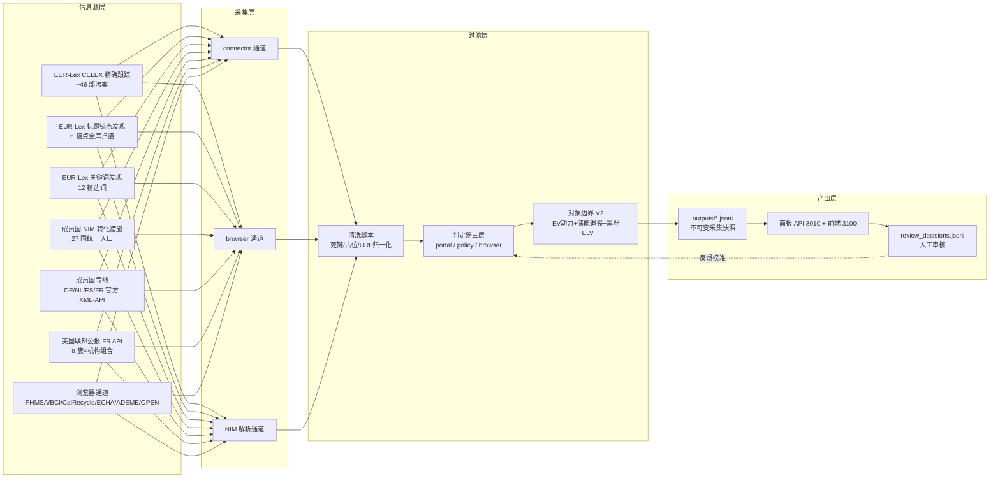

# 退役电池回收 OSINT 系统 —— 全流程与规则说明

> 文档版本：v1（2026-09-12） ｜ 用途：**供用户审核**
> 覆盖：从信息源 → 采集 → 清洗 → 相关性判定 → 面板审核 → 反馈校准的完整链路
> 每个 ⭐ 标记处是需要你（用户）确认或可能感兴趣的点

---

## 0. 目标与验收标准

### 0.1 采集目标

欧美（欧盟 + 27 成员国 + 美国联邦/州）关于以下主题的**政策法规**：

| 主题 | 说明 | 归入关键词簇 |
|---|---|---|
| **车用动力电池回收利用** | 退役/报废 EV 动力电池的收集、回收、梯次利用、再生利用 | C1 / C2 / C4 / C5 |
| **黑粉进出贸易** | black mass 的进出口/跨境转移/贸易管制 | C3（+ 关联 C6/C7） |

### 0.2 验收标准的三个来源（按优先级）

1. **中国清单为标尺**（你提供的《中国电池回收政策法规标准》Excel，111 条）
   —— 按清单的**类型口径**（法律法规规章 + 规范性文件 + 标准 + 财税激励；含地方文件）对齐欧美；
   按清单的对象口径（EV 动力电池为主，储能退役/消费类可参照）界定边界。
2. **你的审核判例**（截至 2026-09-12 已 25 条决策，其中 28 个正/负样本固化进测试）
3. **边界口径**（2026-09-12 你确认）：**公开可搜到的政策法规都算**；
   不含隐私、未公开内部资料、付费墙、需登录的私域内容（见 `sources/search-boundary.yaml`）。

### 0.3 标准演进记录（你 4 批审核的判例汇总）

| 批次 | 时间 | 判例要点 |
|---|---|---|
| 1️⃣ | 09-11 | **PHMSA 安全通告 = 标准样本**（退役电池 × 处置回收 × 操作性规则）；FEOC 解释 = 页外（recycling 只作拨款名） |
| 2️⃣ | 09-12 早 | 授权法规收（2025/606 等）；提案收（52020PC0798）；ELV 线收；附件技术修订/ESPR = 待定 |
| 3️⃣ | 09-12 午 | **信息页 ≠ 政策法规**：DDR 科普页❌、OSHA 信息页❌、BCI 行业文章❌；同站 PHMSA 联邦规则✅ |
| 4️⃣ | 09-12 晚 | 捷克电池法令（NIM）✅ 验证 27 国通道；2025/606 待定 ⭐见 §10.1 |

---

## 1. 系统全流程图



**关键设计**：审核结果**不修改**原始采集快照（`outputs/*.jsonl` 是证据，不可变），
另有 `review_decisions.jsonl` 叠加层：**有效判定 = 人工决定 ?? 机器判定**。

---

## 2. 信息源清单

### 2.1 欧盟层（超国家）

| 源 ID | 说明 | 入口/方式 | 状态 |
|---|---|---|---|
| `eu_eurlex_battery_reg` | 核心法案精确跟踪（~46 部 CELEX） | EUR-Lex Cellar SPARQL（批量查询） | ✅ 运行中 |
| `eu_eurlex_keyword` | 关键词发现（12 精选词） | SPARQL 标题检索 | ✅ |
| `eu_eurlex_elv` / `_waste_shipment` / `_crm` | 按法案组跟踪 | 同上 | ✅ |
| 发现层 | 6 锚点标题扫描（电池法/ELV/废物运输/CRMA/旧电池指令/废物框架）→ 与库内对比找缺口 | `scripts/discover_eu_acts.py` | ✅ 90 候选→34 缺口→补采 24 条相关 |
| **NIM 通道** | **成员国转化措施索引（27 国一次覆盖）** | EUR-Lex NIM 页解析 | ✅ 566 条→落盘 396 条 |

**跟踪的欧盟法案组**（CELEX 清单见 `sources/eu-acts-tracked.yaml`）：
- 电池法 `2023/1542` 全家（授权/实施法规、提案、更正、议会决议、影响评估、执行报告）
- ELV 线 `2000/53/EC` + `2026/1738`（车辆循环性法规）全家
- 废物运输 `2024/1157` 全家（**黑粉跨境贸易的欧盟法律载体**）
- 关键原材料 `2024/1252`、废物框架 `2008/98/EC`（母法层）

### 2.2 美国层

| 源 ID | 说明 | 入口/方式 | 状态 |
|---|---|---|---|
| `us_federal_register` | 联邦公报全文检索 | 官方 API（无需 Key） | ✅ 8 簇 × 机构组合（37 组） |
| 缺口扫描 | 8 个边界短语 × 全机构 | `scripts/discover_us_gaps.py` | ✅ 306 候选→1 条边界相关 |
| 短语精查 | `"black mass"` 精确短语（引号语法） | FR API | ✅ 5 条→补采 1 条 |

**FR 机构覆盖**（按簇配置，`sources/policy-eu-us-eol-blackmass.yaml`）：
EPA / DOE / DOT-PHMSA / NHTSA / NIST / FTC / IRS / Commerce-BIS / State / DOJ /
Coast Guard / FRA / FAA / TSA / NTSB / DHS / ITA / ITC / USTR / Interior …（20+ 机构）

### 2.3 成员国层

| 源 ID | 国家 | 方式 | 状态 |
|---|---|---|---|
| `eu_nim_{at,be,bg,cy,cz,dk,ee,fi,fr,de,gr,hr,hu,ie,it,lv,lt,lu,mt,nl,pl,pt,ro,sk,si,es,se}` | 27 国 | NIM 转化措施索引（标题+公报+NIM 详情页） | ✅ 396 条 |
| `de_gesetze` | 德国 | gesetze-im-internet 官方 XML | ✅ |
| `nl_bwb` | 荷兰 | KOOP BWB 官方 XML | ✅ |
| `es_boe` | 西班牙 | BOE 官方 API | ✅ |
| `fr_dila` / `fr_ademe_opendata` | 法国 | DILA 开放数据 / ADEME Data Fair | ✅ |
| `browser_netherlands` / `browser_france` / `browser_echa` 等 | — | 浏览器渲染抓取 | ✅ |

### 2.4 黑粉贸易线专项覆盖现状 ⭐

**本次盘点发现（2026-09-12）**：库内标题含 "black mass"（及 5 种语言变体）的记录 **0 条**。
原因与对策：

| 通道 | 发现 | 说明 |
|---|---|---|
| EUR-Lex 标题 | "black mass" 0 命中 | 欧盟法律文本不用行业词，用"waste batteries / intermediate products"表述——**载体是废物运输条例 2024/1157 家族（已收全）** |
| US FR | `"black mass"` 精确短语 5 条 | 3 条相关已全收（DPAS 指令 / DPA 裁定 / 清洁车辆抵免） |
| 贸易管制工具 | Section 232 加工关键矿产调查、BIS 出口管制、DPA 裁定 | 部分在库；**是否扩大 BIS/232 专项待你确认** ⭐ |

---

## 3. 采集规则

### 3.1 通道与方式

| 通道 | 适用源 | 方式 | 备注 |
|---|---|---|---|
| `connector` | EUR-Lex / FR / 成员国官方 API/XML | 程序化请求 | 主流通道 |
| `browser_capture` | 反爬站点（PHMSA/ECHA/ADEME…） | 无头浏览器渲染 | 判定必须按"页面身份"（标题+URL），见 §4.3 |
| NIM 解析 | EUR-Lex NIM 页 | HTML 解析（国家块 → 条目） | 27 国一次覆盖 |

### 3.2 关键采集机制

1. **CELEX 批量查询**：46 部法案合并批次查询（Virtuoso 端点单查约 66s，批量后约 5s/部）
2. **失败重试**：关键词失败自动重跑一轮（端点响应时间波动极大，不重试 = 把端点抖动误当"无数据"）
3. **发现→缺口→补采闭环**：锚点全库扫描（900+ 候选）→ 与库内对比 → 缺口定向补采
4. **NIM 采集**：解析 NIM 索引页 → 多语言分层过滤 → 近重复检查（对库内同国标题）→ 落盘

### 3.3 采集量级（当前）

```
全库记录 ~3.2k 条（去重后）
├─ 美国联邦 1459（相关 127 / 待审 113）
├─ 欧盟超国家 149（相关 109）
├─ 27 成员国 NIM 396（自动 257 / 待审 139）
└─ 4 国专线 + 浏览器通道（NL 40 / FR 34 / ES 12 / DE 9 …）
```

---

## 4. 过滤与判定规则（审核重点 ⭐）

### 4.1 判定器选择逻辑

```
记录带 channel / meta.relevance_scenario →
  ├─ browser_capture  → judge_browser（页面身份为准，§4.3）
  ├─ eu_nim_*         → NIM 多语言分层（§4.4；全库重判**跳过**该层，防误杀）
  └─ 其余（connector）→ judge_portal_policy（门户类判定，§4.2）
```

**为什么不能用一套规则**：同一句话在不同场景含义不同——政策检索结果是"一篇文档"，
浏览器抓的是整页渲染（含全站导航），门户库是批量文书（含大量行政模板）。

### 4.2 `judge_portal_policy` 判定阶梯（欧盟/FR 记录用）

按顺序（拒绝优先）：

| 步骤 | 规则 | 效果 | 判例 |
|---|---|---|---|
| 0a | 拒绝词（battery-powered、纽扣电池、启动电池等） | 排除 | — |
| 0b | **程序性标题**（信息收集公告/特殊许可通告…） | 排除 | 557 条噪声清理 |
| 0c | **对象边界**：消费类/铅酸（无车用语境） | 排除 | 首轮口径 |
| 0c′ | 边界外但**引用《电池法规》**的适用文件 | 待人工→相关 0.75 | 52025XC00214 指南 |
| 0d | 附件技术修订（amending Annex）/ ESPR 泛产品母法 | 待人工 | 你的 🟡 判例 |
| 0e | 电池法**授权/实施法规**（supplementing/implementing…） | 相关 0.9 | 2025/606、2025/2289 |
| 0f | **综合立法包**（标题列举 ≥4 部法规、电池只作裸号） | 待人工 | 中小企业简化包 |
| 1 | 标题命中**处置链**（退役电池×回收/处置/拆解/运输…多语言） | 相关 0.9 | PHMSA 标准 |
| 2 | 身份区（标题+摘要前 900 字符）命中：标题有锚点→0.75；无→0.5 待人工 | — | — |
| 3a | 正文多处提及处置链 | 待人工 0.5 | NESHAP 案例 |
| 3b | 电池材料/供应链类（无处置语义） | 待人工 0.5 | 09094 清洁车辆抵免 |
| 3c | 黑粉监管四线（出口管制/巴塞尔/关键矿产/执法） | 待人工 | — |
| 4 | 其余 | 排除 | — |

**两条核心判据**（源于你的判例）：

1. **身份优先**：主依据 = 标题 + 摘要；不采信全文任意位置的命中（"某处提到"≠"在讲这个"）
2. **"回收/处置"的两种出现方式分开**：
   - 被规制对象（"shipping batteries **for recycling**"）→ ✅ 证据
   - 财政工具宾语（"**Recycling Grants** programs"）→ ❌ 不是证据（08913 判例）

### 4.3 `judge_browser` 判定阶梯（浏览器通道用）

| 步骤 | 规则 | 效果 |
|---|---|---|
| 1 | 页面类型噪声（隐私政策/招聘/404/死链"Page non trouvée"/WAF 拦截页） | 排除 |
| 1c | **信息/科普/资讯页**：科普措辞（understanding/hazards/global issue/FAQ…）且无法律文书标志 | 排除 ⭐你的第 3 批判例 |
| 2 | 同母类产品线（纺织/包装/床垫…与电池共享 EPR 词汇的导航噪声） | 排除 |
| 3 | 页面身份含电池/ELV 锚点（多语言） | 相关 |
| 3b | 导航型页面（About Us/首页…且无电池线索） | 排除 |
| 4 | 身份无电池、正文强相关 | 待人工 |

**"信息页 ≠ 政策法规"规则的射程**：科普、行业文章、网络研讨会、新闻、机构栏目页 → 排除；
但**同一站点的法律文书保留**（如 PHMSA 通告：含 "Notice/Advisory" 等法律标志即豁免）。

### 4.4 NIM 层分层规则（27 国转化措施用）

| 层 | 判据（24 语种词表） | 结果 |
|---|---|---|
| tier1 | 标题含**电池/车辆/黑粉**词（battery/batterie/Batterie/аккумулятор/μπαταρία/黑粉系列…；ELV 各语言：Altfahrzeug/véhicules hors/autowrak/piles…） | 相关 0.75 |
| tier2 | 仅含泛废物/回收词（waste/afval/Abfall/otpad/atliek…） | 待人工 0.5 |
| 引用型 | 纯法令编号式标题（"Acte législatif N°…"） | 待人工 0.5（不静默丢） |
| 其余 | — | 丢弃 |

⚠️ **实测修复的语言盲区**（这些国家的整类法律曾被漏收）：
丹麦 `bil/ophug/skrot`（汽车拆解报废法）、瑞典 `bilskrotning/producentansvar`（汽车报废令/EPR）、
捷克 `životnost`（寿命终止产品法）、克罗地亚 `otpad`、立陶宛 `atliek`、瑞典 `renhållning`。

### 4.5 对象边界（最终口径）

| ✅ 收 | ❌ 不收 |
|---|---|
| EV 动力电池（整包/模组/电芯）| 消费类电池（纽扣/家用/便携）|
| 储能电池退役 | 铅酸（铅酸动力亦然）|
| **黑粉**（多语言） | 泛产品母法、纯程序性文书 |
| ELV 报废车辆（与退役车用电池强相关）| 科普/新闻/行业文章（信息页）|
| 电池法规的授权/实施/适用文件 | |
| 财税激励（如 45X/IRA，中国清单含财税类）→ 材料类待人工 | |

### 4.6 特殊豁免与例外（防误杀清单）

1. **PHMSA 通告标准样本**永远豁免：含 "Safety Advisory Notice"（法律标志）
2. **2018/849**（ELV+电池修订指令）：标题仅 1 个法规号，不经 omnibus 降级
3. **简化包但含电池 EPR 实体内容**（52025AE3982）：保留相关
4. **法语复数**：`véhicules hors d'usage`（复数）— 模式已修正（曾险些整层误杀比利时 NIM）
5. **`batterie` 坑**：法语词与英语 "Batteries" 前缀同形，无法词形区分 → 已剔除，
   法语层由 `accumulateur/pile usagée` 承担（荷兰语 `batterij`、西语 `batería` 保留——英语中不存在）

---

## 5. 数据落盘与去重

- **落盘**：`outputs/*.jsonl`（一行一记录：evidence_id / region / channel / source_id / url / title / publish_date / relevant / relevance_score / needs_human_review / hits / rejected_by / meta / text）
- **去重**：同 evidence_id 保留更优通道（connector > vane > browser_capture）；EU 记录按 evidence_id 去重（防 Cellar/eurlex 双链重复显示）
- **URL 归一化**：Cellar UUID 链 → eurlex 可读链
- **备份**：每次重判/清洗自动备份 `outputs/_backup_*`

## 6. 面板与人工审核

- **地图**（29 个地区）→ 点国家 → 记录列表（只看相关/待复核筛选）
- **记录点开** = 「收录原因」框（机器判据全透明：判定/分数/通道/命中模式/拒绝词/待复核说明）
  + 正文摘要 + 三态裁决（相关/待定/不相关）+ **备注输入框（拒绝原因，200 字）**
- **审核写入** `review_decisions.jsonl`，**绝不修改原始数据**；撤销 = 重写该文件
- 备注用途：我通过 `scripts/show_review_feedback.py` 读取 → 调整规则 → 重判 → 固化测试

## 7. 反馈校准闭环（已跑通）

```
你在面板填备注/裁决
  → review_decisions.jsonl
  → show_review_feedback.py 汇总（备注 + 按来源分布）
  → 我调整判定规则（改代码 + 新增判例测试）
  → rejudge_standard_v2.py 重判全库（自动备份 + 可回溯 + 跳过已审核）
  → 面板即时生效
  → 回归测试保证不违背历史判例（21+20 条断言）
```

## 8. 质量保障

| 防线 | 工具 | 现状 |
|---|---|---|
| 判例回归测试 | `tests/test_portal_judge.py` | **21/21** |
| 浏览器判定自检 | `relevance_browser.py` 内置样本 | **20/20** |
| 去重回归 | `tests/test_channel_dedupe.py` | **5/5** |
| 覆盖审计 | `audit_collection_coverage.py` | exit 0（无缺口） |
| 数据质量 | `clean_data_quality.py` | 死链/占位/短文定期清理 |
| 边界核查 | `check_rejudge_edges.py` / `show_rejudge_changes.py` | 重判前预览误杀/误收 |

## 9. 已知坑与防护（血泪清单）

| 坑 | 防护 |
|---|---|
| EUR-Lex 端点耗时波动大（6s~95s）→ 误判"无数据" | 失败自动重跑；0 条也打印（区分"跑了没命中"与"没跑"） |
| SPARQL `\(` 非法转义（5 批固定失败） | 转义修正 + 批量查询 |
| NIM 记录被通用规则重判 → 整层误杀 | 重判**跳过** `eu_nim_*`（由采集器自治） |
| 死链页因 URL 锚点翻案 | 法语 "Page non trouvée" 模式 |
| hits 重复 → React 告警 | 判定器去重 + 前端键防御 |
| PowerShell `>` 重定向产出 UTF-16 | 读取时自适应编码 |
| 面板 API 改代码后需重启 | 已记录（进程须重启加载） |

## 10. ⭐ 需要你审核/确认的点

### 10.1 `2025/606` 的判定位（请复核）

你 05:32 判**相关**（×3），07:20→07:21 改为**待定**。但其完整标题是：
> "…establishing the methodology for calculation and verification of **rates for recycling efficiency and recovery of materials from waste batteries**, and the format for the documentation"
即"**废电池回收效率与材料回收率的计算验证方法**"——按你"车用动力电池回收利用"的口径应为相关。
**疑为误点，请复核**（面板刷新后在 EU 国家抽屉里可找到该记录）。

### 10.2 黑粉贸易线的补强方向（请选择）

- [ ] A. 维持现状（WSR 家族 + 已收到的 US 贸易工具）
- [ ] B. 加 BIS 出口管制专项（美方 black mass/电池材料出口管制文件）
- [ ] C. 加巴塞尔公约相关文本（EU 实施文件、会议文件）
- [ ] D. 其他：______

### 10.3 US 州级 50 州是否启动采集？

（边界口径已确认"公开可搜都算"，州级属边界内；当前仅加州 CalRecycle 一条通道）

### 10.4 信息页排除规则的射程

"科普/新闻/行业文章/网络研讨会"一律排除——如你认为**指南类**（如 "Lithium Battery Guide for Shippers"）
应保留，请确认（当前判断：合规指南保留、纯科普排除）。

---

*文档维护：规则变更时同步更新本文件 ｜ 生成：2026-09-12*
