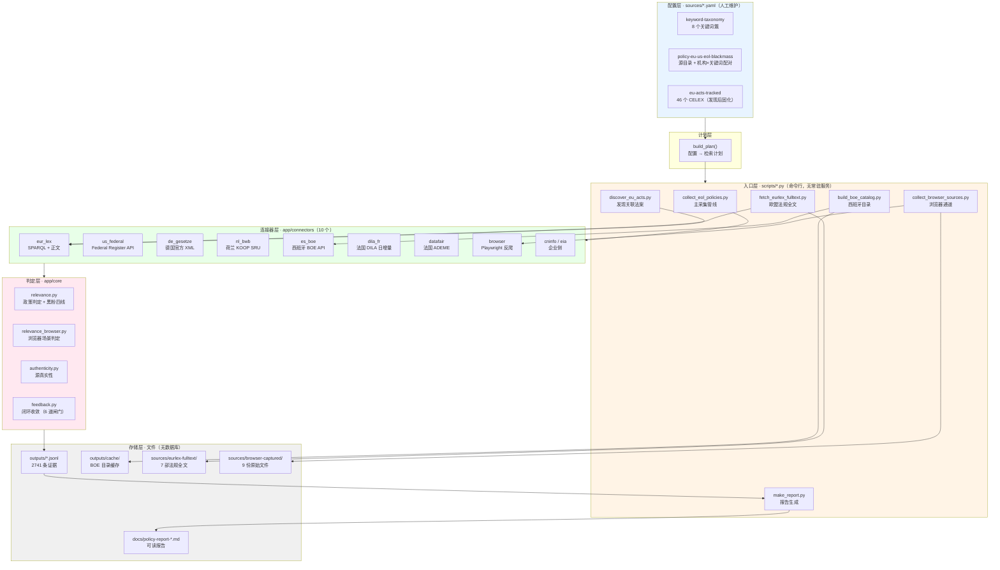
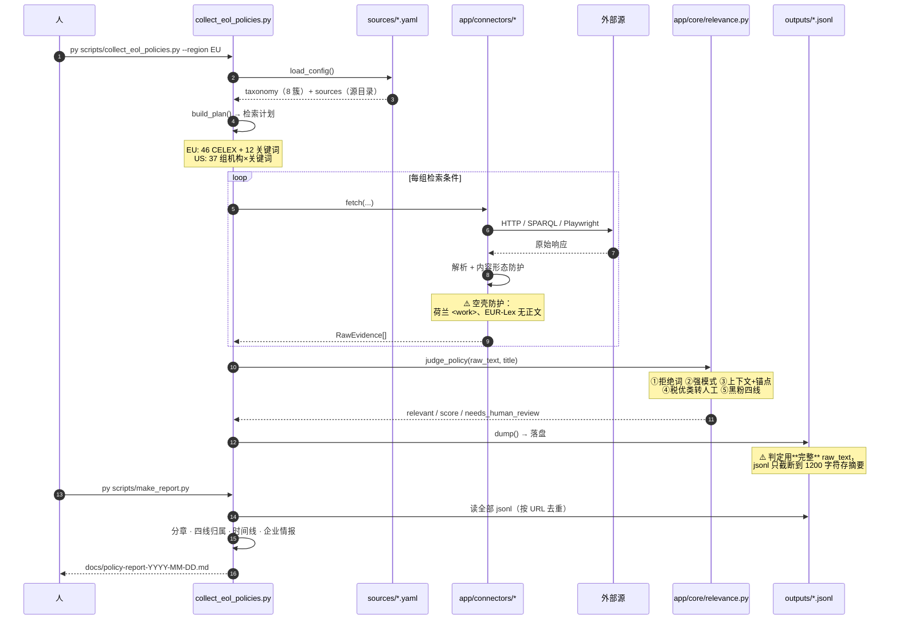

# 运行架构与部署状态（实测）

> 生成日期：2026-09-11
> 本文只写**当前真实在跑的东西**，不写设计方案。
> 每一条结论都附**取证方式**，可以自己复现。
>
> 配套阅读：[ARCHITECTURE.md](../ARCHITECTURE.md)（设计架构）· [04 二次开发方案-后端](../04_二次开发方案-后端.md)（后端方案）

---

## 零、结论速览

| 组件 | 状态 | 一句话说明 |
|---|---|---|
| **Vane** | ❌ **未部署** | 仓库里没有它的任何运行产物；`channel="vane"` 在 2,741 条记录里出现 **0 次** |
| **SearXNG** | ❌ **未部署** | 只以环境变量名 `SEARXNG_API_URL` 出现在**设计稿**的 compose 片段里 |
| **Docker** | ⚠️ CLI 已装，**守护进程未运行** | `docker ps` 报 `failed to connect to the docker API` |
| **实际在跑的是** | ✅ **纯 Python 采集层** | 10 个连接器 + CLI 脚本 + 文件存储，不依赖任何容器 |
| **数据落地形态** | ✅ 文件 | `outputs/*.jsonl`（2,741 条）+ `sources/` 下的原文快照 |

> **一句话**：这个项目目前是**一套可以直接跑的 Python 采集管线**，
> 不是 README/ARCHITECTURE 里描述的那个"Vane 调度中枢 + MySQL/Redis/MinIO + Celery + FastAPI"系统。
> 后者是**设计稿**，尚未实现。

---

## 一、Vane 是否部署？—— 否

### 1.1 五条取证

| # | 取证方式 | 结果 |
|---|---|---|
| ① | 仓库里找 compose / Dockerfile / .env | **一个都没有**（`docker-compose*`、`Dockerfile*`、`.env*` 全无） |
| ② | `docker ps -a` | `failed to connect to the docker API at npipe://...` —— **守护进程没开** |
| ③ | 探测 Vane 默认端口 | `localhost:3000` → **000**（连不上） |
| ④ | `app/` 下找 Vane 客户端 | **没有** `app/core/vane.py`；`app/` 只有 `connectors/` 与 `core/` |
| ⑤ | 统计已采数据里的 `channel` 字段 | 见下表 —— **`vane` 出现 0 次** |

命令（可复现）：

```powershell
# ① 仓库内的容器化产物
Get-ChildItem -Recurse -Depth 2 -File | Where-Object { $_.Name -match 'docker-compose|Dockerfile|^\.env' }
# ② docker 守护进程
docker ps -a
# ③ 端口
foreach ($p in 3000,8080) { curl.exe -s -o NUL -m 4 -w "%{http_code}" "http://localhost:$p/" }
# ⑤ 数据里的通道路径
py -c "import glob,io,json,collections; c=collections.Counter()
for f in glob.glob('outputs/eol_*.jsonl'):
    for l in io.open(f,encoding='utf-8'):
        try: c[json.loads(l).get('channel') or '?']+=1
        except: pass
print(dict(c))"
```

### 1.2 决定性证据：2,741 条记录里 `channel="vane"` 为 0

```
jsonl 记录总数: 2741
channel 分布: { 'connector': 1545, 'browser_capture': 150, '未标注': 1046 }
```

- `connector` —— 定向直采（本项目的**全部**有效产能）
- `browser_capture` —— 浏览器通道（绕反爬）
- `未标注` —— 早期记录（`channel` 字段是后加的）
- **`vane` —— 0 条**

> `RawEvidence.channel` 的声明里写着 `# "connector" | "vane" | "manual"`，
> 但**代码里 `vane` 只出现在这一行注释中**（全仓库 `app/` 内 grep `vane` 仅 1 处命中）。
> 也就是说：Vane 通道是**数据模型上的预留位**，从未被实现，也从未产出过一条数据。

### 1.3 那些"看起来像已部署"的地方

| 位置 | 实际是什么 |
|---|---|
| `04_二次开发方案-后端.md` 里的 `docker-compose` 片段（含 `itzcrazykns1337/vane:latest`、`SEARXNG_API_URL`、`vane-data` 卷） | **设计方案**，不是仓库里的文件。文中没有对应的 `docker-compose.yml` |
| `07_Python采集脚本详解.md` 里的 `modules/vane_search.py`、`VANe_URL=http://localhost:3000` | 同样是**方案稿**；`scripts/modules/` 目录**不存在** |
| `README.md` 文档索引里「01 快速开始指南 —— Vane 部署」 | 状态列写的是 **⏳ 待写** |
| `ARCHITECTURE.md` 第一句「Vane / SearxNG 如何发挥作用」 | 描述的是**设计意图**，不是现状 |

---

## 二、SearXNG 是否部署使用？—— 否

| 检查项 | 结果 |
|---|---|
| 端口 8080（SearXNG 默认） | **无监听** |
| 容器 / 镜像 | 无（且 Docker 守护进程未运行） |
| 配置目录（`searxng/settings.yml` 之类） | 不存在 |
| 代码中的引用 | 仅 `04_二次开发方案-后端.md` 的 compose 片段里作为**环境变量名**出现 |
| 数据中的痕迹 | 0 条 |

**结论**：SearXNG 一次都没跑过。它是 Vane 的元搜索后端——**Vane 没部署，SearXNG 自然也没有存在的理由**。

### 2.1 顺带更正一条已失效的论据

`ARCHITECTURE.md` §2.1 用这样一条"实测结论"来论证 Vane 的必要性：

> ⚠️ **实测结论**：`eur-lex.europa.eu` 对普通 HTTP 客户端返回 **202 + 挑战页**（即使伪装浏览器 UA 也一样）。
> 所以"欧盟法规的权威原文，通用搜索通道确实搜不到"。

**这条已被证伪**（2026-09-11 复测）：

```
方案                                    结果
──────────────────────────────────────  ──────────────────────
EUR-Lex HTML 直连（带浏览器 UA）          ✅ 200 / 9.7 MB
Cellar + Accept: application/xhtml+xml   ✅ 200
Cellar + Accept: application/pdf         ✅ 200（4.7 MB PDF）
Cellar + Accept: text/html               ❌ 404（Accept 协商是真实存在的）
```

现状：项目**不依赖任何通用搜索通道**，已经直接抓到 7 部欧盟法规全文（`sources/eurlex-fulltext/`，共约 1.26 MB），
并用 EUR-Lex SPARQL 精确跟踪 **46 个 CELEX**（含 14 次更正）。

> 📌 **教训**：`ARCHITECTURE.md` 里所有 `⚠️ 实测结论` 都应标注**实测日期**并定期复验。
> 站点策略会变，一次实测不能当永久事实。（同类：CalRecycle 的 `/bev/` 标注 `verified: true`，现已 404。）

---

## 三、当前真实运行架构

### 3.1 架构图（只含已实现的部分）



**图中没有的东西**：MySQL · Redis · MinIO · Celery · FastAPI · Nginx · Vane · SearXNG。
它们在 `04_二次开发方案-后端.md` 里都有完整设计，但**代码里一个都不存在**。

### 3.2 三条通道的真实状态

| 通道 | 设计 | 实际 |
|---|---|---|
| **A · 通用搜索（Vane/SearXNG）** | 广度发现 | ❌ **未实现**（0 条数据） |
| **B · 定向直采 Connector** | 权威源深度 | ✅ **主力**：10 个连接器，1,545 条 |
| **B′ · 浏览器通道** | 绕反爬 | ✅ 150 条（PHMSA / CalRecycle / BCI / ECHA 等） |
| **C · 人工投喂** | 补盲 | ⏳ 数据结构有（`channel="manual"`），**0 条** |

> 也就是说：设计里"三条通道并行"，实际是**一条半**（B + B′）。
> 而这条 B 通道的覆盖已经远超设计预期——见 §五。

---

## 四、运行逻辑（从命令到报告）

### 4.1 一次完整采集的数据流



### 4.2 关键设计点（都是踩坑换来的）

| # | 设计点 | 为什么 |
|---|---|---|
| 1 | **判定用完整正文，摘要才截断** | jsonl 摘要不足以判定归属：黑粉①线在摘要上长期为空，而《废物运输条例》全文里 `shipments of waste` 出现 84 次 |
| 2 | **空壳防护**：取到 `<work>` 直接抛错 | 荷兰 KOOP 的作品级 XML 只有元数据，`autowrak` 出现 **0 次**——会产出"成功但空壳"的记录 |
| 3 | **判定前并入已落盘的正文快照** | EUR-Lex 的 jsonl 记录只有 CELEX 号，导致报废车指令 2000/53/EC 被判为不相关。量化结果：**37 条里 15 条（40%）被静默丢弃** |
| 4 | **批量查询 + 重试** | 单个 CELEX 查询实测 66 秒，46 个要 40 分钟；合批后约 17.5 秒/个 |
| 5 | **文档类型级噪声过滤** | 联邦公报的批量行政文书（信息收集公告、许可通告）会偶尔命中关键词 |
| 6 | **判定分层，宁可多审不可漏** | 税优/能源类判"相关 + 待人工复核"，而非直接丢弃 |

### 4.3 采集礼仪（内建的约束）

```python
RATE_LIMITS = {
    "eur-lex.europa.eu": 3.0,          # 秒/请求
    "publications.europa.eu": 2.0,
    "zoekservice.overheid.nl": 2.0,
    "repository.officiele-overheidspublicaties.nl": 1.5,
    "federalregister.gov": 1.0,
    ...
}
USER_AGENT = "BatteryRecyclingOSINT/1.0 (+research; contact: chiyuzhinian)"
```

- 单域名限速 + 随机抖动
- 可识别 User-Agent
- TLS 不兼容时**自动回退 curl**（Windows 下走 SChannel）
- 瞬时失败**必须重试后再下结论**（DILA / SPARQL / ECHA 都曾把"抖动"误判成"源不可用"）

---

## 五、文档与实现的偏差（务必知晓）

`README.md` / `ARCHITECTURE.md` / `04` 描述的是一个**目标系统**；本文档描述的是**现状**。
两者差距如下：

| 文档里的组件 | 文档中的角色 | 实现状态 |
|---|---|---|
| Vane | 调度中枢：需求拆解 + 多源搜证 | ❌ 0% |
| SearXNG | 元搜索层（广度来源） | ❌ 0% |
| Claude API | 深度分析 / 逻辑检查 | ❌ 未接入（报告由 `make_report.py` **模板化生成**） |
| MySQL | 正式表 | ❌ 未实现，数据在 jsonl |
| Redis / Celery / Beat | 调度与队列 | ❌ 未实现，采集靠**手动跑 CLI** |
| MinIO | 对象存储 | ❌ 未实现，快照在 `sources/` 本地目录 |
| FastAPI + Nginx | API 与出口 | ❌ 未实现 |
| 钉钉告警 | 出口 | ❌ 未实现 |
| **`app/connectors/*`（10 个连接器）** | 通道 B | ✅ **已实现，是真正的产能所在** |
| **`app/core/*`（判定/闭环）** | 验证层 | ✅ 已实现（`relevance` / `relevance_browser` / `feedback` / `authenticity`）|
| **`sources/*.yaml`（源目录）** | 配置 | ✅ 已实现 |
| **`docs/policy-report-*.md`** | 报告 | ✅ 已实现（41,169 字符，9+ 章）|

> ⚠️ **注意状态标注的三种含义**：README 文档索引里
> `✅` = 文档已写 · `⏳ 待写` = 文档没写。
> **它标的是"文档状态"，不是"实现状态"** —— 容易误读，建议区分成两列。

### 5.1 为什么"通道 B"能顶上来（设计外的收获）

设计稿假设"通用搜索负责广度、定向采集负责深度"。实测发现二者**可以倒过来**：

| 源 | 用的什么 | 效果 |
|---|---|---|
| 德国 `gesetze-im-internet` | **官方 XML 包** | 6,130 部法规目录，一次接通整层 |
| 荷兰 `KOOP BWB` | **官方 SRU 检索 + 版本级 XML** | 库容 148,242 条，抓到 22 个历史版本 |
| 西班牙 `BOE` | **官方 REST API（19 个端点）** | 全量目录 12,395 部 |
| 法国 `DILA` | **官方开放数据日增量** | 每天两批，LEGI + JORF |
| 欧盟 `EUR-Lex` | **SPARQL + HTML 正文** | 46 个 CELEX，7 部全文 |
| 美国 `Federal Register` | **官方 JSON API** | 15 个机构 × 27 个关键词 |

**关键认知：绝大多数政府源都有官方结构化接口，识别出来直接用 API，比经过通用搜索层更准、更全。
通用搜索更适合"发现你还不知道的源"，而不是"拿权威原文"。**

---

## 六、如果要补齐（可选路径）

按"投入产出比"排序：

| 优先级 | 事项 | 说明 |
|---|---|---|
| ⭐⭐⭐ | **不部署 Vane 也能满足当前需求** | 见 §5.1：定向通道已覆盖 6 国 + 2 国际组织 |
| ⭐⭐ | 接 **Claude API** | 报告目前是模板拼装；接 LLM 可做"变更影响分析""跨源矛盾检测" |
| ⭐⭐ | 把 jsonl 换成 **SQLite/Postgres** | 2,741 条还行，条数上千后去重与查询会变吃力 |
| ⭐ | 加 **定时任务**（Windows 任务计划即可） | 目前靠手动跑 CLI；政策源建议周更 |
| ⭐ | **Vane + SearXNG** | 仅当需要"发现未知源"时才值得。**必须先跑通 Docker 守护进程** |
| — | MySQL/Redis/MinIO/Celery/FastAPI/Nginx | 属"要做成多用户服务"才需要的，研究型单人使用**过度设计** |

### 6.1 若真要部署 Vane + SearXNG

**前置条件（当前都不满足）**：
1. Docker Desktop **守护进程必须启动**（现在是 `failed to connect to the docker API`）
2. 准备 LLM API Key（Vane 需要）
3. 仓库内**新增** `docker-compose.yml`——目前只有设计稿片段

**建议部署顺序**：先 SearXNG（8080）跑通 → 再 Vane（3000）指向它（`SEARXNG_API_URL`）→ 最后接 `app/core/vane.py` 客户端（需新写）。

---

## 七、如何自己复现本文的所有结论

```powershell
# 1. 部署状态
docker ps -a                                   # → 守护进程未运行
curl.exe -s -o NUL -w "%{http_code}" http://localhost:3000/   # → 000
curl.exe -s -o NUL -w "%{http_code}" http://localhost:8080/   # → 000

# 2. 通道路径（vane 应为 0）
py -c "import glob,io,json,collections
c=collections.Counter()
for f in glob.glob('outputs/eol_*.jsonl'):
    for l in io.open(f,encoding='utf-8'):
        try: c[json.loads(l).get('channel') or '?']+=1
        except: pass
print(dict(c))"

# 3. 连接器清单
py -c "import sys; sys.path.insert(0,'.'); from app.connectors import REGISTRY; print(list(REGISTRY))"

# 4. 检索计划（当前覆盖面）
py scripts/collect_eol_policies.py --dry-run

# 5. 测试是否全绿
Get-ChildItem tests\test_*.py | ForEach-Object { py $_.FullName }
```

---

## 八、一句话总结

> **这个项目现在是一套"没有 Vane 的 Vane 项目"。**
> Vane 与 SearXNG 均未部署，也从未产出一条数据；
> 真正在跑的是 10 个定向连接器 + 浏览器通道 + 判定引擎 + 模板化报告，
> 靠 `outputs/*.jsonl`（2,741 条）与 `sources/` 下的原文快照承载全部成果。
> 设计文档描述的目标系统（MySQL/Redis/MinIO/Celery/FastAPI/钉钉）**尚未动工**。
